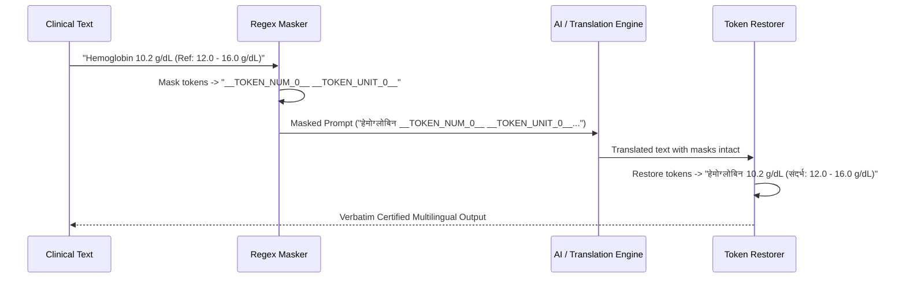

# CareCue — Health Explanations & Multilingual Translation

## 1. Simple-Language Health Explanations

### Overview
Laboratory panels and pathology reports are frequently filled with obscure clinical jargon, Latin abbreviations, and reference metrics that confuse patients. CareCue bridges this gap by translating complex clinical observations into accessible, plain-language explanations while strictly enforcing non-diagnostic boundaries.

### Dual Explanation Tiers
1. **STANDARD Level**:
   - Aimed at patients with general health literacy.
   - Clarifies physiological role, common reasons the biomarker was ordered, and standard contextual implications.
2. **BEGINNER Level**:
   - Aimed at first-time patients or those unfamiliar with medical terminology.
   - Avoids clinical jargon, using simple everyday analogies (e.g. comparing hemoglobin to "delivery trucks that bring oxygen to your muscles and brain").

### Three-Section Explanation Architecture
Every CareCue explanation consists of three structured sections:
1. **Explained Simply**: Plain-language description of what the test measures.
2. **Why It Appears in Your Report**: Explains why physicians routinely order this test and quotes the exact laboratory reference range verbatim.
3. **What to Discuss with Your Doctor**: 2–3 specific, productive questions for the patient's next consultation.

### Critical Safety Guardrails
- **Zero Medical Advice / Prescription**: Never diagnoses conditions, prescribes pharmaceuticals, or instructs patients to alter medication dosages.
- **Verbatim Token Preservation**: All numerical values, units (e.g., `mg/dL`, `g/dL`, `mIU/L`), reference intervals, and page citations are preserved exactly as printed on the original report.

---

## 2. Multilingual Translation

### Supported Languages
- **English (`en`)**: Primary interface and clinical baseline.
- **Hindi (`hi` — हिन्दी)**: Complete script translation for patient summaries, explanations, and visit briefs.
- **Bengali (`bn` — বাংলা)**: Complete script translation for patient summaries, explanations, and visit briefs.

### Number & Range Protection Engine
In medical translations, translating numbers or units into localized scripts or rounding values can lead to severe clinical misunderstandings. CareCue prevents this using an automated two-pass Token Masking & Restoration pipeline:

### In-Memory & Session Caching
- Translated strings are cached in-memory by language and text hash to minimize latency and redundant model calls.
- Cache invalidates safely across distinct user sessions.
