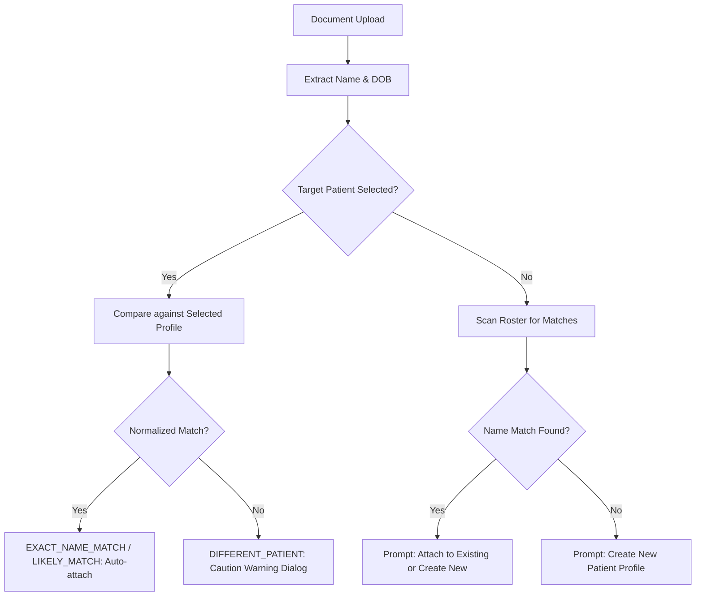

# CareCue — Patient Management & Record Tracking

## 1. Overview
CareCue enables holistic longitudinal patient record management with intelligent multi-document tracking, conservative identity matching, and safe disambiguation. Designed for clinical safety, it ensures that distinct patients' records are never conflated while making it easy to track a single patient's biomarker trajectory over time.

---

## 2. Core Capabilities

### A. Manual Patient Registration
- Form fields: Full Legal Name (required), Date of Birth, Phone Number, Email, and Clinical Context/Notes.
- Automatically initializes an active clinical chart with unique identifier `pat-<timestamp>` or DynamoDB UUID.
- Instantly ready to receive documents, track findings, and assemble visit briefs.

### B. Add Patient from Document
- Automatically parses uploaded medical PDFs and scanned lab reports for patient identification header information.
- Dual-pass extraction identifies candidate patient names and birth dates with calibrated confidence scores.
- Prompts user to review and confirm extracted identity before creating the new profile.

### C. Existing Patient Document Ingestion
- Seamlessly attaches new clinical records directly to an established patient profile.
- Supports all 5 clinical document classifications:
  - **LAB**: Standard lab panels, metabolic tests, blood counts.
  - **PRESCRIPTION**: Doctor scripts, medication guidelines, titration schedules.
  - **REPORT**: Imaging reports, pathology summaries, specialist letters.
  - **DISCHARGE**: Hospital discharge summaries, inpatient notes.
  - **OTHER**: Insurance forms, vitals logs, miscellaneous health documents.

---

## 3. Intelligent Identity Matching Engine

### Normalization & Match Types:
1. **Title & Suffix Stripping**: Honorifics (`Dr.`, `Mr.`, `Ms.`, `Mrs.`) and credentials (`MD`, `PhD`, `MBBS`) are stripped prior to comparison.
2. **Match Classifications**:
   - `EXACT_NAME_MATCH`: Identical normalized name tokens (e.g. "Rahul Das" vs "rahul das").
   - `LIKELY_MATCH`: High Jaro-Winkler token similarity or initials match with matching birth year.
   - `DIFFERENT_PATIENT`: Target patient selected (e.g. Emily Davis) but document contains conflicting name (e.g. Rahul Das). Triggers high-priority safety confirmation dialog.
   - `NO_MATCH`: Extracted name does not correspond to any known profile in the roster.

---

## 4. Multi-Document Comparison & Trajectories
- **Conservative Comparison Rule**: CareCue never claims a trend unless both values share identical unit definitions and biomarker names.
- **Biomarker Trajectory Table**:
  - Compares historical findings chronologically (earliest to latest).
  - Explicitly flags when reference intervals differ between laboratories.
  - Generates clear doctor discussion questions regarding any observed shifts.

---

## 5. Security & Isolation
- Patient data is isolated using DynamoDB partition keys (`PATIENT#<patientId>`).
- Identity extraction strictly enforces regex-based sanitization to prevent prompt injection or header manipulation.
